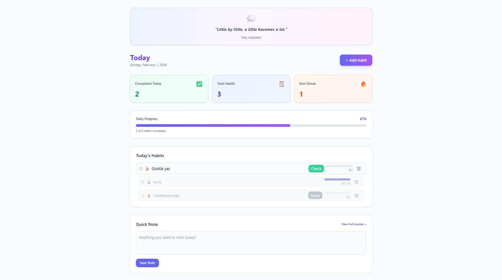
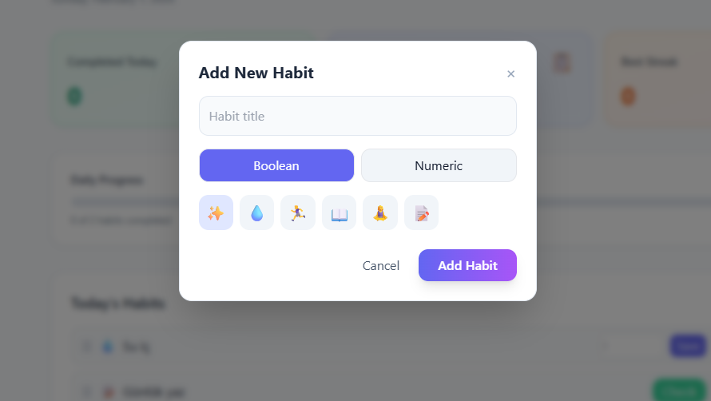
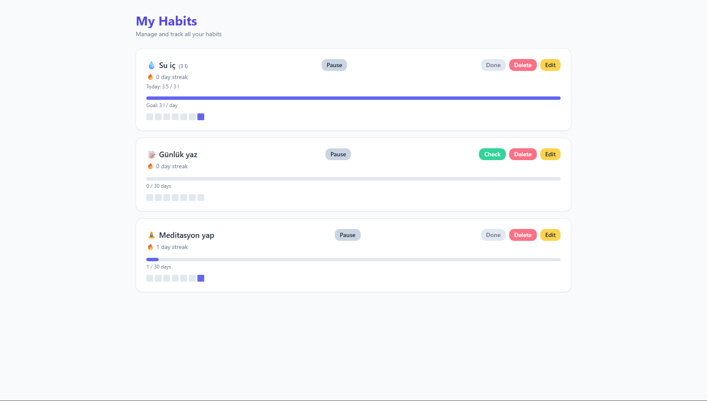
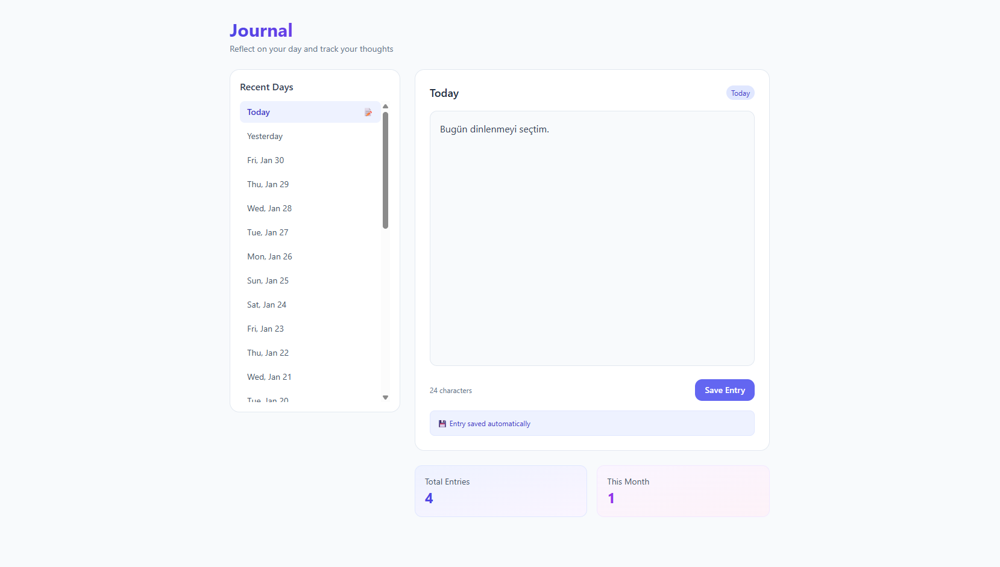
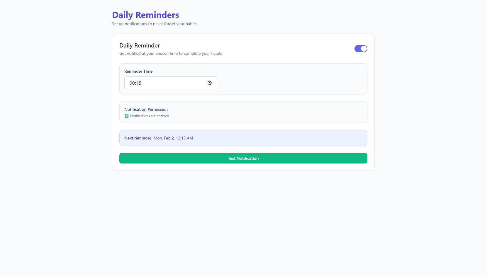
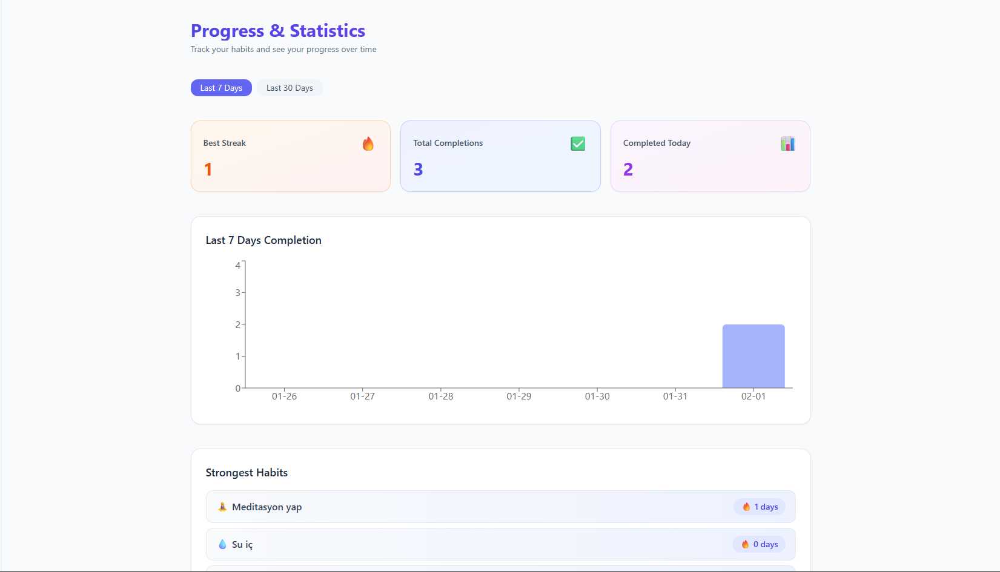
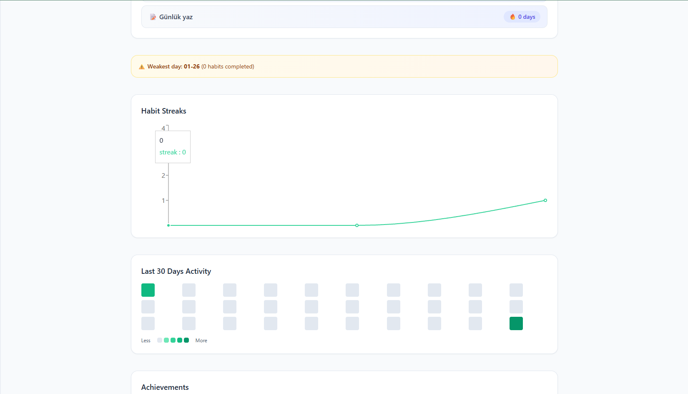
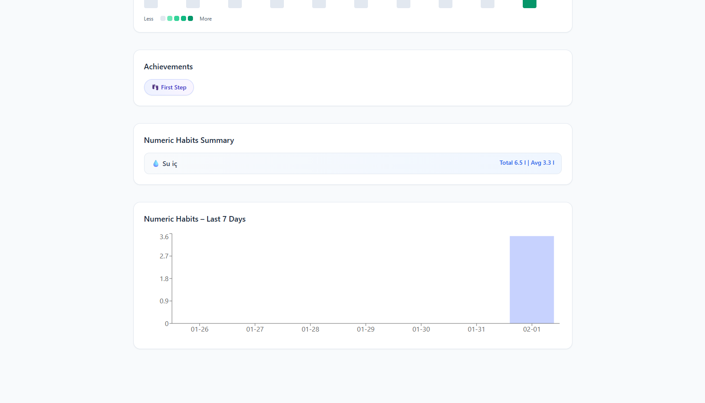

[](https://react.dev/)
[](https://vitejs.dev/)
[](https://tailwindcss.com/)
[](LICENSE)

# Mindful Habits 🧠✨

**Mindful Habits** is a simple and clean habit-tracking web application built with **React**.  
It helps users build consistency by tracking daily habits and encouraging mindful routines.

---

## 🌱 Features

- Add and track daily habits  
- Minimal and user-friendly interface  
- Progress and consistency awareness  
- Responsive design  
- Lightweight and fast React application

---

## 🖼️ Screenshots

### HomePage

<p align="center">
  
  
</p>

### Habits Page
<p align="center">
  
</p>

### Journal Page
<p align="center">
  
</p>

### Reminders Page
<p align="center">
  
</p>

### Progress Screens

<p align="center">
  
  
  
</p>


> A clean and minimal interface designed to keep users focused on their daily habits.

---

## 🚀 Getting Started

Follow the steps below to run the project locally.

### Prerequisites

- Node.js (v16 or higher recommended)
- npm or yarn

### Installation

1. Clone the repository:

```bash
git clone https://github.com/zeynepeceyunkul/mindful-habits.git
cd mindful-habits
```
2. Install dependencies:

```bash
npm install
# or
yarn install
```
3. Start the development server:

```bash
npm start
# or
yarn start
```
The application will run at:
👉 http://localhost:3000

## 🛠️ Built With
- React – UI library

- Vite – Fast development and build tool

- Tailwind CSS – Utility-first CSS framework

## 📂 Project Structure
```bash
mindful-habits/
├─ public/
├─ src/
│  ├─ components/
│  ├─ assets/
│  └─ App.jsx
├─ screenshots/
│  └─ app.png
├─ package.json
└─ README.md
```
## 🤝 Contributing
Contributions are welcome!

1. Fork the repository

2. Create a new branch (git checkout -b feature/your-feature)

3. Commit your changes

4. Push to the branch

5. Open a Pull Request

## 📄 License
This project is licensed under the [MIT License](LICENSE).

## 📬 Contact
For questions, feedback, or suggestions, feel free to open an issue on GitHub.

